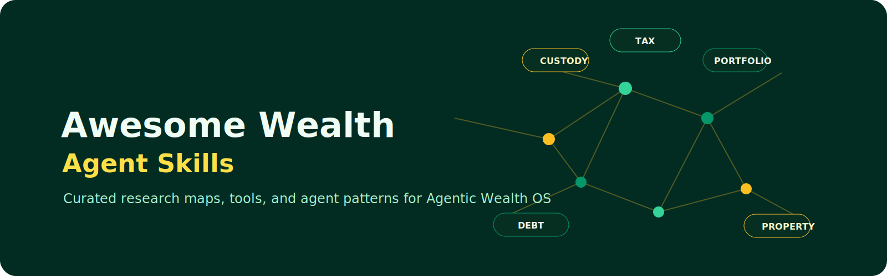

<p align="center">
  
</p>

<h1 align="center">Awesome Wealth Agent Skills</h1>

<p align="center">
  <strong>A public-safe catalog of tools, repos, and agent patterns for building a private Agentic Wealth OS.</strong>
</p>

<p align="center">
  <a href="https://awesome.re"></a>
  <a href="LICENSE"></a>
</p>

<p align="center">
  <a href="#start-here">Start Here</a> ·
  <a href="#core-categories">Categories</a> ·
  <a href="#agentic-wealth-os-role">OS Role</a>
</p>

This repo is for research organization, source discovery, and agent skill design. It is not financial, investment, legal, tax, accounting, or securities advice.

## Operating Standard

| Principle | Standard |
| --- | --- |
| Human ownership | The human owns capital, wallets, accounts, decisions, and backups. |
| Research before action | Agents may collect evidence, draft memos, score tools, and run simulations. |
| No live money by default | Trading, transfers, signing, custody changes, and irreversible actions require human execution. |
| Private by design | Positions, wallet material, account data, and private strategy stay out of public repos. |
| Fail closed | Ambiguous, over-cap, wallet, or live-money requests escalate instead of proceeding. |

## Start Here

- [Selection Matrix](docs/selection-matrix.md)
- [Public Safety Rules](docs/public-safety.md)
- [agentic-wealth-os](https://github.com/frankxai/agentic-wealth-os) — private wealth management planning engine.
- [brother-property-os](https://github.com/frankxai/brother-property-os) — property asset tracking.
- [property-intelligence-system](https://github.com/frankxai/property-intelligence-system) / [property-os-template](https://github.com/frankxai/property-os-template) / [property-portal-template](https://github.com/frankxai/property-portal-template) — real estate engines.
- [Catalog Data](data/repos.json)
- [Wealth Research Skill](skills/wealth-research/SKILL.md)

## Core Categories

### OSS Bloomberg And Data Terminals

- [OpenBB](https://github.com/OpenBB-finance/OpenBB) - financial data platform for analysts, quants, and AI agents. This is the primary open-source Bloomberg-terminal-style seed.
- [yfinance](https://github.com/ranaroussi/yfinance) - market data access for research and prototypes.

### Portfolio, Net Worth, And Privacy

- [Ghostfolio](https://github.com/ghostfolio/ghostfolio) - open-source wealth management software.
- [rotki](https://github.com/rotki/rotki) - privacy-protecting portfolio tracking, analytics, accounting, and management.
- [QuantStats](https://github.com/ranaroussi/quantstats) - portfolio analytics for quants.

### Custody And Sovereignty

- [Safe Smart Account](https://github.com/safe-fndn/safe-smart-account) - smart-account infrastructure for secure blockchain asset management.
- [Safe Wallet](https://github.com/safe-global/safe-wallet-monorepo) - wallet application surface for Safe accounts.

### Discovery Catalogs

- [awesome-quant](https://github.com/wilsonfreitas/awesome-quant)
- [Awesome AI4Finance](https://github.com/AI4Finance-Foundation/Awesome_AI4Finance)
- [awesome-systematic-trading](https://github.com/paperswithbacktest/awesome-systematic-trading)
- [awesome-crypto-trading-bots](https://github.com/botcrypto-io/awesome-crypto-trading-bots)

## Agentic Wealth OS Role

This repo feeds the private `agentic-wealth-os` with public-safe source maps:

1. Find credible OSS projects and current metadata.
2. Classify each project by usefulness, execution risk, privacy risk, and integration role.
3. Promote only public-safe patterns into installable skills.
4. Keep any live strategy, wallet, account, tax, or private financial data out of this repo.

## Validation

```powershell
./scripts/validate-catalog.ps1
```

The validator checks required catalog fields and scans public Markdown for unsafe claims or private-data leakage patterns.

## License

CC0 1.0 Universal. See [LICENSE](LICENSE).
