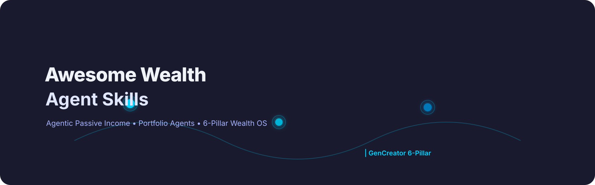
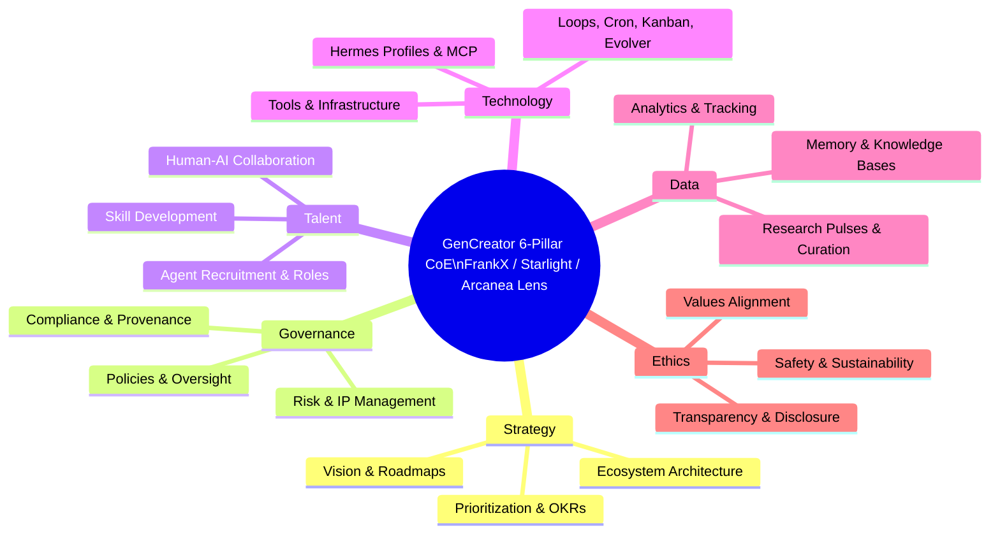

  

<h1 align="center">Awesome Wealth Agent Skills</h1>

  <strong>Curated through the GenCreator 6-Pillar CoE lens • Starlight Swarm • Arcanea Creative Execution • Agentic Passive Income Systems</strong>

  <a href="#contents">Contents</a> ·
  <a href="#6-pillar-mapping">6-Pillar Mapping</a> ·
  <a href="#explore-the-full-frankx-awesome-ecosystem-17-lists">Full Ecosystem (17)</a> ·
  <a href="#contributing">Contribute</a>

> **THE definitive curated resource for wealth-agent-skills** — Agentic Wealth OS, portfolio intelligence, custody tools, passive income agents, 6-Pillar wealth governance. Research catalog (no financial advice).

## Why This List Exists
Agentic passive income is core to wealth pillar. Emphasizes sovereign tools, provenance, risk management (Governance/Ethics), and compounding systems. Strict public boundary: no private wallet data or live trading recommendations.

## Contents
- [Top Picks](#top-picks)
- [Agentic Wealth OS & Portfolio Agents](#agentic-wealth-os--portfolio-agents)
- [Custody & Security Tools](#custody--security-tools)
- [Research & Analytics](#research--analytics)
- [MCP & Agent Skills](#mcp--agent-skills)
- [Agentic Passive Income & Loops](#agentic-passive-income--loops)
- [6-Pillar Mapping](#6-pillar-mapping)
- [Explore the Full FrankX Awesome Ecosystem (17+ Lists)](#explore-the-full-frankx-awesome-ecosystem-17-lists)
- [Contributing](#contributing)

## Top Picks
| Category | Recommended | 6-Pillar Fit |
|----------|-------------|--------------|
| OS | Agentic Wealth OS patterns | All pillars |
| Income | agentic-passive-income skill | Income pillar |
| Governance | Provenance tools | Governance + Ethics |

## Agentic Wealth OS & Portfolio Agents
- Patterns from agentic-passive-income and 6-pillar wealth OS.
- Portfolio tracking agents, rebalancing simulators (research only).
- Integration with kanban for wealth loops.

## Custody & Security Tools
- Hardware wallet research, multi-sig patterns, self-custody best practices (public sources only).
- Security audit agents.

## Research & Analytics
- Public market data APIs, on-chain analytics (sanitized).
- Cross with investor-agent-skills for quant research.

## MCP & Agent Skills
- gstack wealth skills.
- Load skill_view(name='agentic-passive-income')

## Agentic Passive Income & Loops
Core integration: recurring research pulses, automated reporting agents, skill marketplaces for wealth tools.
- See agentic-passive-income skill for full framework.

## 6-Pillar Mapping

```mermaid
mindmap
  root((GenCreator 6-Pillar CoE\nFrankX / Starlight / Arcanea Lens))
    Strategy
      Vision & Roadmaps
      Prioritization & OKRs
      Ecosystem Architecture
    Governance
      Policies & Oversight
      Compliance & Provenance
      Risk & IP Management
    Talent
      Agent Recruitment & Roles
      Human-AI Collaboration
      Skill Development
    Technology
      Hermes Profiles & MCP
      Tools & Infrastructure
      Loops, Cron, Kanban, Evolver
    Data
      Memory & Knowledge Bases
      Research Pulses & Curation
      Analytics & Tracking
    Ethics
      Values Alignment
      Transparency & Disclosure
      Safety & Sustainability
```

**Wealth focus**: Heavy on Governance (risk, custody), Ethics (transparency, no advice), Data (analytics), Income (passive systems).

## Explore the Full FrankX Awesome Ecosystem (17+ Lists)
Curated through the GenCreator 6-Pillar CoE lens • Starlight Swarm • Arcanea Creative Execution • Agentic Passive Income Systems

- [awesome-jarvis](https://github.com/frankxai/awesome-jarvis)
- [awesome-manifestation-skills](https://github.com/frankxai/awesome-manifestation-skills)
- [awesome-agentic-income](https://github.com/frankxai/awesome-agentic-income)
- [awesome-hermes-agents](https://github.com/frankxai/awesome-hermes-agents)
- [awesome-ai-coe](https://github.com/frankxai/awesome-ai-coe)
- [awesome-design-agent-skills](https://github.com/frankxai/awesome-design-agent-skills)
- [awesome-music-agent-skills](https://github.com/frankxai/awesome-music-agent-skills)
- [awesome-agent-operating-systems](https://github.com/frankxai/awesome-agent-operating-systems)
- [awesome-hermes-agent-skills](https://github.com/frankxai/awesome-hermes-agent-skills)
- [awesome-wealth-agent-skills](https://github.com/frankxai/awesome-wealth-agent-skills) ← You are here
- [awesome-gamification-agent-skills](https://github.com/frankxai/awesome-gamification-agent-skills)
- [awesome-investor-agent-skills](https://github.com/frankxai/awesome-investor-agent-skills)
- [awesome-automation-agent-skills](https://github.com/frankxai/awesome-automation-agent-skills)
- [awesome-cosmos-ai-agents](https://github.com/frankxai/awesome-cosmos-ai-agents)
- [awesome-mind-agent-skills](https://github.com/frankxai/awesome-mind-agent-skills)
- [awesome-payment-agent-skills](https://github.com/frankxai/awesome-payment-agent-skills)
- [awesome-motion-design-agent-skills](https://github.com/frankxai/awesome-motion-design-agent-skills)

## Contributing
Strict adherence to AGENTS.md public boundary. Read CONTRIBUTING.md and provenance rules. No financial claims. Use issue templates. Add 6-Pillar Fit.

**Maintenance**: Updated via awesome-list-maintenance skill + gencreator-swarm-evolver. Last research pulse: 2026-07-01

*Elevated with patched template: mermaid 6-pillar, 17-list cross links, hero.svg, .github/ standards, gh topics/description. Verified with gh/git.*
